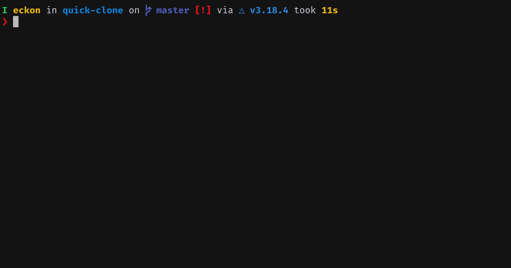

# Quick Clone

[](https://github.com/eckon/quick-clone/actions/workflows/release.yml)

A small cli tool to search and clone git repositories from the terminal (currently only Gitlab-v4 endpoints).


## Disclaimer

This is a personal "for-fun" project. It was only tested on my machine and configured to my liking. It is my first "real" c++ and tui project (which is pretty obvious when looking into the code) so please consider this before doing anything.

If the tool does not work and/or you want another quick solution, have a look at the [side-note](#side-note) for a bash script with most functionalities.


# Usage

Run the `qc` command. This will open up the interactive TUI (on first run, the [basic config](#general) will be generated).


## Example




## Views
* Query-Prompt (starting position)
  * `UP/DOWN` select between different git endpoints (provided by config file)
  * `TYPE` in prompt to set search query (pre-filter of endpoint)
    * Empty search: get repositories with newest activity
  * `ENTER` send request to selected git endpoint
    * Nothing found: continue on Query-Prompt
    * Something found: automatic switch to Filter-Prompt
* Filter-Prompt
  * `UP/DOWN` select repository
  * `TYPE` in prompt to filter search result
  * `ENTER` clone selected repository and terminate app
  * `LEFT/RIGHT` switch between prompts


# Setup
Either download the newest [AppImage](#appimage) (see [Releases](https://github.com/eckon/quick-clone/releases)) and run it
or [compile the repo manually](#general) and run it.


## AppImage

* Download the Appimage on the Releases page
* Make it executable `chmod +x <file>`
  * For systems that can not run it (Windows: WSL)
  * Extract it with `./<file> --appimage-extract`
  * Run the executable in `./squashfs-root/usr/bin/qc`
* Run it


## General

* Currently there is no pre-compiled binaries (ignoring [appimage](#appimage))
  * To install: have the needed [dependencies](#dependencies) and [compile](#commands) the tool on your machine
* On first run, the application will create (if not already existing) the following:
  * Folders for `~/.config/quick-clone/`
  * Config file `~/.config/quick-clone/config.json`
  * Add example data to the config file
    * Only the official gitlab repo works for testing the rest are just example data that will not work


## Config
* Add access token in Gitlab with (at least) API-read permissions
  * Can be found in your personal settings under "Access Tokens"
* ~~(Create)~~ Update config file at `~/.config/quick-clone/config.json` (_names etc. might change_)
  * An array structure is used, for the purpose of having multiple git endpoints
  * Every element is an objcet inside the array `[{...}, {...}, ...]` with the following
    * `name` - Will be shown in the app to identify the selected endpoint
    * `access_token` - Is needed to have access to the endpoint, needs at least read access
    * `url` - URI to the Gitlab endpoint

Example
```json
[
  {
    "name": "Work Gitlab",
    "access_token": "work-token",
    "url": "https://git.workplace.com/api/v4/projects"
  },
  {
    "name": "Personal Gitlab",
    "access_token": "personal-token",
    "url": "https://gitlab.com/api/v4/projects"
  }
]
```


## Side-note

The first version of this tool was a simple bash script, which uses different tools like `fzf`, `jq`, `awk`, `curl` and maybe others.

This should work on most machine that supports bash and the other tools and can be found in my [dotfiles](https://github.com/eckon/dotfiles/blob/master/custom-scripts/gitlab-search-and-clone.sh).


# Dependencies

- ncurses e.g. `apt install libncurses5-dev libncursesw5-dev`
- libcurl e.g. `apt install libcurl4-openssl-dev`
- nlohmann/json3 e.g. `apt install nlohmann-json3-dev`


## Commands

```sh
# generate Makefile in build/
$ cmake -S . -B build/
# for older versions of cmake
$ cd build/ && cmake .. && cd ..

# compile executable (binary can be found in ./build/bin/qc)
$ make -C build/

# format repository
$ clang-format -i --style=Google src/**/*.cpp src/**/*.h

# generate appimage
# when doing manual, do not forget to setup the wanted version in the script (CI/CD does it automatically)
$ ./generate/generate-appimage.sh
```
